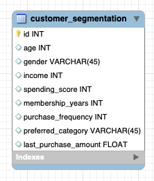

# Mini Project: SQL Customer Segmentation

Mini Project created for Week 7 of Ironhack's Data Analytics Bootcamp.

## Data
Using [Customer Segmentation Data for Marketing Analysis](https://www.kaggle.com/datasets/fahmidachowdhury/customer-segmentation-data-for-marketing-analysis) from Kaggle. Simulated customer data created for customer segmentation practice. 
  
## Business Questions
- High-value segments: which demographics generated the most revenue in their last purchase?
- Loyalty: are customers with longer memberships also the ones with better spending scores?
- What are the preferred categories per customer segment? 

## Customer Segmentation
- Created segmentations based on:
  - Gender <-- column for this category already existing.
  - Age <-- created age_group column with CASE-WHEN, and stored the new table in the view `age_groups`.
  - Customer category <-- created customer_category column with CASE-WHEN based on the spending_score column, and stored the new table in the view `customer_categories`.

## Schema


## Stored Procedures
### `last_purchase_revenue_per_segment` 
-  Prints a table with the sum of the last purchase grouped by the groups in a chosen segment. Takes two arguments:
   - `segment_view`, a varchar with the name of the view/table we want to explore.
   - `segment_column`, a varchar with the name of the column we want to use to group by.

Use example:
````sql
CALL last_purchase_revenue_per_segment("age_groups", "age_group");
````

### `preferred_categories_per_segment`
- Prints a table with the count of customers in each group in the chosen segment that prefers each product category, and the percentage it represent within its group. Takes two arguments:
   - `segment_view`, a varchar with the name of the view/table we want to explore.
   - `segment_column`, a varchar with the name of the column we want to use to group by.
  
Use example:
````sql
CALL preferred_categories_per_segment("customer_segmentation", "gender");
````

## Initial Exploration
### Categorical variables
#### Gender:

|Gender|Customer under this category|
|------|----------------------------|
|Male  |357                         |
|Other |327                         |
|Female|316                         |

#### Preferred category:

|Preferred Category|Customer under this category|
|------------------|----------------------------|
|Electronics       |215                         |
|Sports            |210                         |
|Home & Garden     |206                         |
|Groceries         |199                         |
|Clothing          |170                         |

### Numerical variables
#### General averages:

|Age|Spending Score|Membership Years|Purchase Frequency|Last Purchase Amount|
|--------|-------------------|---------------------|-----------------------|-------------------------|
|43.7830 |50.6850            |5.4690               |26.5960                |492.3486693048477        |

#### Averages per categorical variables:
- Gender:
  
|Gender |Age|Spending Score|Membership Years|Purchase Frequency|Last Purchase Amount|
|-------|--------|-------------------|---------------------|-----------------------|-------------------------|
|Female |43.8766 |51.6962            |5.3165               |25.4241                |458.0188920678972        |
|Other  |45.1651 |51.7890            |5.5107               |25.8654                |521.4389283241482        |
|Male   |42.4342 |48.7787            |5.5658               |28.3025                |496.0901116229573        |

- Preferred category:
  
|Preferred Category|Age|Spending Score|Membership Years|Purchase Frequency|Last Purchase Amount|
|------------------|--------|-------------------|---------------------|-----------------------|-------------------------|
|Groceries         |43.7940 |51.2563            |5.3216               |27.1608                |487.2793965315699        |
|Sports            |44.1048 |51.0143            |5.4810               |27.1143                |481.9531896772839        |
|Clothing          |44.7882 |51.9765            |5.5000               |25.6824                |489.64841214909274       |
|Home & Garden     |43.3495 |49.1359            |5.2233               |26.4515                |505.60063006114035       |
|Electronics       |43.0791 |50.2977            |5.8047               |26.4279                |496.6322776971861        |

## Answers to Business Questions
- High-value segments: which demographics generated the most revenue in their last purchase?

|Gender|Revenue (last purchase per customer)|
|------|------------------------------------|
|Male  |177104.17                           |
|Other |170510.53                           |
|Female|144733.97                           |

|Age Group|Revenue (last purchase per customer)|
|---------|------------------------------------|
|Young adult|104944.94                           |
|Seniors  |103591.66                           |
|Over-forties|102689.03                           |
|Over-fifties|96555.97                            |
|Over-thirties|84567.07                            |

|Customer Category|Revenue (last purchase per customer)|
|-----------------|------------------------------------|
|Medium customer  |127549.16                           |
|Good customer    |124231.19                           |
|Bad customer     |121049.7                            |
|Great customer   |119518.62                           |

- Loyalty: are customers with longer memberships also the ones with better spending scores?

|Membership Years|Spending Score Average|
|----------------|----------------------|
|8               |55.89                 |
|9               |53.63                 |
|3               |51.43                 |
|5               |50.17                 |
|4               |50.10                 |
|10              |49.95                 |
|1               |49.93                 |
|2               |49.67                 |
|7               |49.15                 |
|6               |47.26                 |

- What are the preferred categories per customer segment?

|Gender|Preferred Category|Customers who prefer this category|Percentage|
|------|------------------|--------------------------------------------|----------|
|Female|Home & Garden     |68                                          |21.52%    |
|Male  |Sports            |77                                          |21.57%    |
|Other |Electronics       |74                                          |22.63%    |

|Age Group    |Preferred Category|Customers who prefer this category|Percentage|
|-------------|------------------|----------------------------------|----------|
|Young adult  |Electronics       |52                                |23.21%    |
|Over-thirties|Sports            |48                                |26.82%    |
|Over-forties |Home & Garden     |48                                |23.19%    |
|Over-fifties |Electronics       |41                                |21.58%    |
|Seniors      |Sports            |46                                |23.00%    |

|Customer Category|Preferred Category|Customers who prefer this category|Percentage|
|-----------------|------------------|----------------------------------|----------|
|Bad customer     |Home & Garden     |55                                |22.54%    |
|Medium customer  |Electronics       |61                                |23.37%    |
|Good customer    |Groceries         |55                                |22.54%    |
|Great customer   |Electronics       |59                                |23.51%    |


## Resources
- [_Customer Segmentation: Definition, Examples + How to Do It_, Coursera](https://www.coursera.org/articles/customer-segmentation)
- [_How to Create a Customer Segmentation Model in SQL_, GeeksforGeeks](https://www.geeksforgeeks.org/sql/how-to-create-a-customer-segmentation-model-in-sql/)
- [_Customer Segmentation: Implementing the RFM Model with SQL_, Medium](https://medium.com/%40shirvaron/customer-segmentation-implementing-the-rfm-model-with-sql-8d07fd990d32)
- [_Know Your Customers: Step-by-Step Guide to Customer Segmentation Analysis with SQL (Plus The Code To Get Started)_, New Prediction](https://newprediction.com/customer-segmentation-with-sql/)

- [Presentation](https://docs.google.com/presentation/d/15mRESaiZxd_OOaQQssvAN-PAZM6-iN7SlBD2VBhOxIQ/edit?usp=sharing)
[](https://docs.google.com/presentation/d/15mRESaiZxd_OOaQQssvAN-PAZM6-iN7SlBD2VBhOxIQ/edit?usp=sharing)